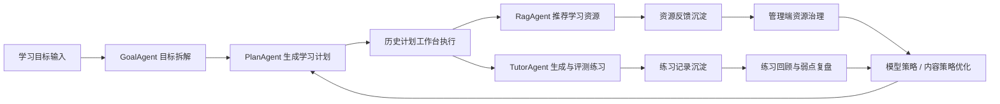
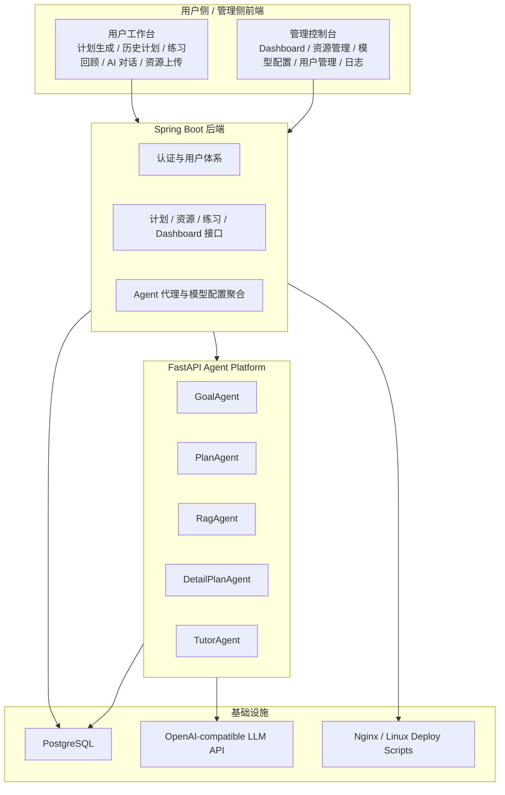
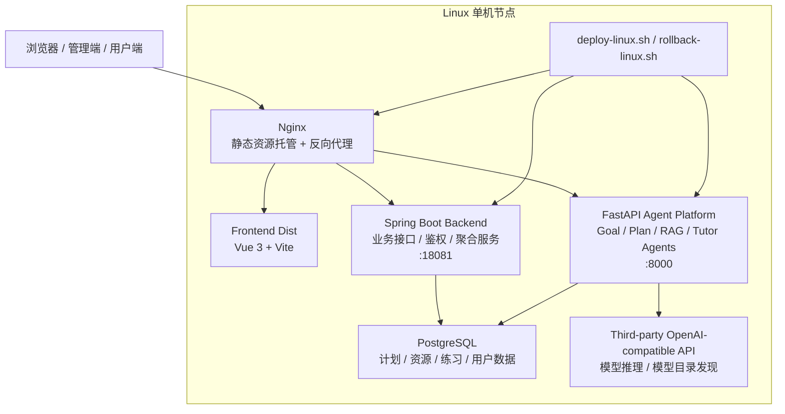

# LearnFlow

> 面向智能学习场景的多 Agent 学习规划平台  
> 以“目标理解 -> 计划生成 -> 资源推荐 -> 练习评测 -> 复盘优化”为主线，构建一套可持续迭代的学习工作台。

## 项目画像

| 维度 | 描述 |
| --- | --- |
| 项目类型 | 智能学习规划平台 / 多 Agent 系统原型 |
| 核心问题 | 如何把“学习目标”转化为可执行、可回顾、可优化的连续学习流程 |
| 产品形态 | 用户工作台 + 管理控制台 + Agent 平台 |
| 技术特征 | Vue 3 + Spring Boot 3 + FastAPI + OpenAI 兼容模型接入 |
| 当前阶段 | 已完成较完整原型闭环，并具备 Linux 单机部署能力 |

## 项目概览

**LearnFlow** 是一个围绕“个性化学习规划”打造的智能系统原型。  
它并不止于“生成一份学习计划”，而是试图把学习过程中的几个关键环节统一到同一套产品闭环中：

- 用自然语言描述学习目标，由系统自动拆解主题与阶段
- 生成按周、按天组织的结构化学习计划
- 基于学习主题推荐更贴近目标的学习资源
- 在执行过程中生成练习、给出 AI 评测与下一步建议
- 将计划、练习、资源反馈与历史回顾沉淀为连续的学习轨迹
- 在管理端统一治理资源、模型与运行策略

从产品定位上看，LearnFlow 更像是一个将「AI 班主任、学习教研组、资源策展器、练习助教」整合在一起的学习工作台。

## 学习闭环



## 核心价值

### 1. 让学习目标真正变成可执行计划

用户不需要先理解复杂的课程设计方法，只需输入自然语言目标，例如：

> “8 周入门 Java 后端开发，每天学习 2 小时，希望最终能够完成一个 Spring Boot 小项目。”

系统会基于目标、周期、基础水平与阶段重点，生成具备结构感的学习路线，而不是简单罗列知识点。

### 2. 让“执行”与“回顾”成为同一条链路

LearnFlow 把计划生成、每日任务执行、资源推荐、练习评测和练习回顾串成一条连续体验。  
用户不是在多个孤立页面之间来回切换，而是在同一套学习工作台中持续推进。

### 3. 让 AI 能力真正沉淀为系统能力

本项目采用多 Agent 架构，不把 AI 仅仅当作一个问答框，而是把它嵌入目标理解、计划组织、任务细化、练习生成、资源推荐与模型策略管理等关键节点。

## 系统能力版图

### 用户侧工作台

- **学习计划生成**
  - 输入学习目标、学习周期、每日投入时间、基础水平等信息
  - 生成按阶段、按周、按日组织的学习计划

- **历史计划工作台**
  - 查看最近学习计划
  - 按计划切换、按日程索引浏览
  - 查看每日任务、计划进度、推荐资源与练习内容
  - 支持计划重命名、删除、任务细化与计划顺延

- **练习回顾**
  - 回看历史练习作答、AI 得分、错因分析与下一步建议
  - 支持按计划筛选、只看待复习内容
  - 支持删除单条练习记录或清空某个学习日的记录

- **AI 对话**
  - 面向学习过程中的问答、解释与辅助理解
  - 当前界面聚焦“当前模型状态展示”，不再暴露复杂模型策略给普通用户

- **资源上传**
  - 用户可上传学习资源并跟踪审核状态
  - 推荐空态与上传入口已联通，形成资源冷启动补充路径

### 管理侧控制台

- **Dashboard**
  - 展示计划、资源、用户、Agent 运行概况等核心指标
  - 已接真实后端聚合数据，而非静态原型

- **资源管理**
  - 审核、编辑、上下架资源
  - 支持质量统计、反馈治理与内容运营

- **模型配置**
  - 统一维护第三方 API、默认模型、自动发现策略与计划生成开关
  - 模型选择能力收敛到管理端，避免普通用户侧的策略复杂度外溢

- **用户管理与日志调试**
  - 管理用户角色与状态
  - 查看 Agent 调用日志与运行细节

## 关键设计思想

### 1. 从“生成结果”转向“学习闭环”

许多 AI 学习产品停留在“给你一份答案”或“生成一份计划”的阶段。  
LearnFlow 更强调的是学习链路本身：

1. 理解目标
2. 组织计划
3. 推荐资源
4. 生成练习
5. 记录反馈
6. 回顾弱点
7. 再次优化

换句话说，系统的重点不是一次性生成，而是持续性陪伴与动态调整。

### 2. 用户侧简化，管理侧收敛

随着模型、资源和推荐策略越来越复杂，普通用户不适合直接承担这些配置成本。  
因此 LearnFlow 将模型策略、资源治理和运行策略逐步收敛到管理端，把用户侧聚焦在“学习体验”本身。

### 3. 以工作台而不是单页工具的方式组织功能

无论是历史计划页还是练习回顾页，当前设计都在向“工作台”演化：

- 左侧负责导航与索引
- 中部负责内容主体
- 顶部与卡片结构负责上下文与状态反馈

这使系统从 demo 页面逐步走向更完整的产品原型。

## 技术架构

LearnFlow 当前采用三层结构：



### 前端

- Vue 3
- Vite
- Naive UI

职责：

- 承载用户端与管理端页面
- 组织工作台式交互与视觉体系
- 对接后端 API，展示计划、资源、练习、日志与模型配置

### 后端

- Spring Boot 3
- Spring Data JPA
- PostgreSQL

职责：

- 用户认证与基础数据管理
- 学习计划、资源、练习记录等核心业务接口
- 对 FastAPI Agent 平台进行统一代理
- 为管理端聚合 Dashboard 与模型配置能力

### Agent 平台

- FastAPI
- Uvicorn
- OpenAI 兼容 LLM 接口

职责：

- GoalAgent：理解与拆解学习目标
- PlanAgent：生成学习计划
- RagAgent：推荐学习资源
- DetailPlanAgent：细化日任务
- TutorAgent：生成与评测练习

## 项目结构

```text
LearnFlow/
├─ frontend/          # Vue 前端（用户端 + 管理端）
├─ backend/           # Spring Boot 后端
├─ agent-platform/    # FastAPI 多 Agent 平台
├─ docs/              # 设计文档、进度报告、部署说明
└─ scripts/           # Linux 部署 / 回滚脚本与模板
```

## 当前实现亮点

截至目前，项目已具备以下较完整能力：

- 学习计划生成、持久化与按用户隔离
- 历史计划页双层导航与工作台式浏览体验
- 整份计划与单日维度的资源推荐
- 练习生成、评测、记录保存与回顾页复盘
- 资源上传、上传记录、审核状态查询联动
- 管理端 Dashboard 与模型配置页接入真实数据链路
- 第三方模型目录自动发现与管理端集中配置
- Linux 单机部署脚本与回滚脚本

## 代表性页面

当前版本已经形成较清晰的页面矩阵：

- **生成学习计划页**
  - 承接目标输入，是整条学习闭环的起点
- **历史计划页**
  - 已演进为“复盘工作台”，承接计划浏览、任务执行、资源与练习联动
- **练习回顾页**
  - 用于沉淀作答记录、AI 反馈和待复习问题
- **AI 对话页**
  - 承接解释、追问、辅学等即时交互
- **资源上传页**
  - 补充内容供给，联通上传记录与审核状态
- **管理端 Dashboard / 模型配置页**
  - 将内容治理与模型策略统一收敛到管理侧

## 快速启动

如果你希望先在本地完成最小可运行验证，可以按下面的顺序启动三个核心服务。

### 运行入口总览

| 模块 | 技术栈 | 本地默认地址 | 说明 |
| --- | --- | --- | --- |
| Frontend | Vue 3 + Vite | `http://localhost:5173` | 用户端与管理端统一前端入口 |
| Backend | Spring Boot 3 | `http://localhost:18081` | 业务主服务与管理聚合接口 |
| Agent Platform | FastAPI | `http://localhost:8000` | 多 Agent 编排与模型调用层 |

### 1. 启动前端

```bash
cd frontend
npm install
npm run dev
```

前端负责承接用户侧与管理端的全部页面交互，开发环境默认运行在 `5173` 端口。

### 2. 启动后端

要求：

- Java 17
- Maven
- PostgreSQL

```bash
cd backend
mvn spring-boot:run
```

后端默认运行在 `18081` 端口。  
核心配置文件位于 [`backend/src/main/resources/application.yml`](/D:/Java_Project/LearnFlow/backend/src/main/resources/application.yml)。

### 3. 启动 Agent 平台

要求：

- Python 3.11

```bash
cd agent-platform
python -m venv .venv
.venv\Scripts\activate
pip install -r requirements.txt
uvicorn app.main:app --host 127.0.0.1 --port 8000
```

Agent 平台默认运行在 `8000` 端口，负责目标理解、计划生成、资源推荐与练习评测等智能链路。

## 环境配置

为避免将运行时密钥和环境差异写入仓库，推荐统一通过环境变量完成配置注入。

### Backend 环境变量

| 变量名 | 作用 |
| --- | --- |
| `SPRING_DATASOURCE_URL` | PostgreSQL 连接地址 |
| `SPRING_DATASOURCE_USERNAME` | 数据库用户名 |
| `SPRING_DATASOURCE_PASSWORD` | 数据库密码 |
| `LEARNFLOW_AI_AGENT_BASE_URL` | Agent 平台访问地址 |

### Agent Platform 环境变量

| 变量名 | 作用 |
| --- | --- |
| `LEARNFLOW_DB_URL` | Agent 平台使用的数据库连接 |
| `LLM_API_BASE` | 第三方 OpenAI 兼容接口 Base URL |
| `LLM_API_KEY` | 模型服务访问凭证 |
| `LLM_API_MODEL` | 默认模型名称 |
| `ENABLE_LLM_PLAN` | 是否启用基于模型的计划生成能力 |

## Linux 部署

项目已提供单机 Linux 部署与回滚方案：

- [`scripts/deploy-linux.sh`](scripts/deploy-linux.sh)
- [`scripts/rollback-linux.sh`](scripts/rollback-linux.sh)
- [`scripts/learnflow.env.example`](scripts/learnflow.env.example)
- [`docs/linux-deploy.md`](docs/linux-deploy.md)

### 部署拓扑



这套部署结构的核心思路是：

- 由 `Nginx` 统一承接外部访问，前端静态资源与接口代理保持同一入口
- `Spring Boot` 负责业务主链路、管理端聚合接口与模型配置下发
- `FastAPI Agent Platform` 负责多 Agent 编排、资源推荐、练习生成与模型调用
- `PostgreSQL` 作为统一数据底座，承接计划、资源、练习与用户相关数据
- `deploy-linux.sh` 与 `rollback-linux.sh` 负责单机环境下的部署、切换与回滚

### 典型使用方式

```bash
cp scripts/learnflow.env.example scripts/learnflow.env
vim scripts/learnflow.env
chmod +x scripts/deploy-linux.sh scripts/rollback-linux.sh
sudo bash scripts/deploy-linux.sh scripts/learnflow.env
```

## 文档索引

如果你希望进一步了解项目的设计背景、数据库结构与迭代过程，可以从以下文档继续展开：

- [`docs/progress-report.md`](/D:/Java_Project/LearnFlow/docs/progress-report.md)
- [`docs/db-design.md`](/D:/Java_Project/LearnFlow/docs/db-design.md)
- [`docs/frontend-refactor-spec.md`](/D:/Java_Project/LearnFlow/docs/frontend-refactor-spec.md)
- [`docs/course-design-report.md`](/D:/Java_Project/LearnFlow/docs/course-design-report.md)
- [`docs/linux-deploy.md`](/D:/Java_Project/LearnFlow/docs/linux-deploy.md)

## 安全说明

当前仓库已经完成基础级别的敏感信息收敛：

- 已移除已知硬编码 `LLM Key`
- 数据库访问密码改为环境变量注入
- 运行态缓存、本地密钥文件与部署产物不纳入版本控制

如果你准备继续将 LearnFlow 用于公开展示、课程答辩或长期维护，建议进一步补齐：

- `.env.example`
- Docker Compose 部署
- CI/CD 流程
- 自动化测试与构建校验
- 更严格的密钥管理方案

## 项目愿景

LearnFlow 的目标并不是成为一个“会回答问题的 AI 页面”，  
而是成为一个真正理解学习目标、组织学习节奏、承接学习执行并沉淀学习反馈的智能学习系统原型。

在这个意义上，它更像一套正在生长中的学习操作系统。
