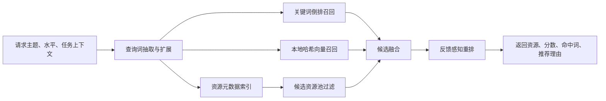

# LearnFlow RAG MVP 实现证据说明

> 本文档记录 2026-05-10 已落地的 RAG MVP 能力，用于项目验收、论文撰写和答辩截图准备。文档只描述仓库中已经实现的代码，不包含未落地能力。

## 1. 实现目标

本次 RAG MVP 的目标是让资源推荐链路从单纯关键词匹配升级为可解释、可验证、可重建的轻量 RAG 流程。当前实现覆盖：

- 资源库元数据索引：从 `resource_bank` 加载 `ACTIVE` 资源，索引标题、领域、等级、标签等元数据。
- 本地向量 fallback：不依赖外部向量库，使用确定性哈希向量构建轻量向量索引，适合演示和论文验证。
- 关键词召回融合：使用关键词倒排索引召回候选资源，再与本地向量召回结果融合。
- 反馈感知重排：读取 `user_resource_feedback` 中的评分、反馈数和无效举报数，对候选资源进行加权重排。
- 索引状态与重建接口：提供索引状态查询和手动重建接口，便于答辩演示和截图取证。

## 2. 代码证据

| 能力 | 代码位置 | 说明 |
| --- | --- | --- |
| RAG Agent 主逻辑 | `agent-platform/app/agents/rag_agent.py` | 实现索引构建、召回、融合、重排和日志记录 |
| 索引状态模型 | `agent-platform/app/models/resource.py` | 新增 `ResourceIndexStatus` 与 `ResourceIndexRebuildResponse` |
| RAG 接口 | `agent-platform/app/routers/rag.py` | 新增 `/api/v2/rag/index/status` 与 `/api/v2/rag/index/rebuild` |
| 反馈表映射 | `agent-platform/app/db.py` | 新增 `UserResourceFeedback` 轻量 ORM 映射，用于 Agent 侧只读统计 |
| 单元测试 | `agent-platform/tests/test_rag_agent.py` | 覆盖索引状态、混合召回、反馈重排 |

## 3. 数据来源

RAG MVP 使用两类数据：

1. `resource_bank`
   - 数据角色：资源候选池。
   - 使用条件：仅加载 `status = ACTIVE` 的资源。
   - 索引字段：`title`、`level`、`domain`、`duration_minutes`、`tags`。

2. `user_resource_feedback`
   - 数据角色：反馈质量信号。
   - 使用字段：`resource_bank_id`、`rating`、`is_reported_invalid`。
   - 重排作用：高评分和较多反馈提高排序，较多无效举报降低排序。

当数据库不可用或资源表为空时，`RagAgent` 会使用内置 `SAMPLE_RESOURCES` 作为 fallback，保证演示环境仍可完成推荐。

## 4. 召回与重排流程



关键步骤：

1. 查询扩展：从学习主题、目标文本、任务文本、领域、水平和任务类型中抽取核心词，并补充领域相关词。
2. 元数据索引：把资源标题、标签、领域和难度等级统一拆成索引词。
3. 关键词召回：通过倒排索引快速定位命中资源。
4. 本地向量召回：使用稳定哈希向量计算查询与资源的余弦相似度，作为无外部向量库时的轻量语义 fallback。
5. 召回融合：合并关键词召回和向量召回候选，并保留命中通道。
6. 反馈重排：结合平均评分、反馈数量、无效举报数量调整最终排序分。

## 5. 对外接口

### 5.1 推荐接口

`POST /api/v2/rag/resources`

用途：根据学习主题、任务上下文和学习者水平返回推荐资源。

可观察字段：

- `resources[].score`：融合召回与反馈重排后的分数。
- `resources[].matched_terms`：命中的查询词。
- `resources[].reason`：包含命中词、召回通道和反馈条数等解释信息。
- `expanded_queries`：查询扩展词。
- `rerank_strategy`：当前策略标识，值为 `metadata-index+keyword-vector-fusion+feedback-rerank`。

### 5.2 索引状态接口

`GET /api/v2/rag/index/status`

用途：查看当前 RAG 索引是否就绪。

核心返回字段：

- `ready`：索引是否可用。
- `resource_count`：参与索引的资源数。
- `keyword_count`：关键词索引词条数。
- `vector_count`：本地向量索引条数。
- `feedback_count`：参与重排的反馈记录数。
- `source`：当前数据来源，可能为 `db` 或 `sample`。
- `fallback_enabled`：是否启用内置样例资源 fallback。

### 5.3 索引重建接口

`POST /api/v2/rag/index/rebuild`

用途：重新加载资源库、反馈统计、关键词索引和本地向量索引。适合在资源审核通过、资源批量更新后手动触发。

## 6. 测试证据

已新增单元测试：

```powershell
cd D:\Java_Project\LearnFlow\agent-platform
python -m unittest discover -s tests -v
```

覆盖范围：

- `test_status_exposes_index_counts`：验证索引状态返回资源数、关键词数、向量数和反馈数。
- `test_keyword_and_vector_recall_prefers_matching_domain`：验证 Spring REST API 查询可以优先召回 Java 领域资源。
- `test_feedback_penalizes_invalid_resource`：验证高评分资源加权、无效举报资源降权。

后端构建验证：

```powershell
cd D:\Java_Project\LearnFlow\backend
mvn test
```

当前 Java 后端无测试源码，Maven 会显示 `No tests to run`，但编译与构建流程通过。

## 7. 论文可写表述

可写入“系统详细设计”或“关键模块实现”的描述：

> 系统在资源推荐模块中实现了轻量级 RAG MVP。Agent 平台启动时从资源库表中加载已审核资源，基于资源标题、标签、领域和难度等级构建元数据索引和关键词倒排索引；同时使用确定性哈希向量生成本地向量表示，在未部署 FAISS 或 Milvus 的情况下提供可复现的向量召回 fallback。推荐时，系统对学习主题和任务上下文进行查询扩展，融合关键词召回与本地向量召回结果，并结合用户资源反馈表中的评分、反馈数量和无效举报数量进行重排。该设计在保证工程可运行性的同时，为后续接入外部向量库保留了清晰的替换点。

## 8. 截图计划

建议答辩或论文中截取以下画面：

1. 索引状态接口响应：展示 `resource_count`、`keyword_count`、`vector_count`、`feedback_count`。
2. 索引重建接口响应：展示重建成功后的状态。
3. 推荐接口响应：展示 `score`、`matched_terms`、`reason` 和 `rerank_strategy`。
4. 资源管理页：展示资源审核状态和资源库数据来源。
5. 资源质量统计页：展示平均评分、反馈数、无效举报数。
6. Agent 调用日志页：展示 `RagAgent` 调用记录和耗时。

## 9. 后续扩展边界

当前 MVP 已经实现可运行的本地向量 fallback，但尚未接入独立向量数据库。后续可以在不改变上层接口的前提下，将 `_embed_terms` 和 `_vector_recall` 替换为 FAISS、Milvus 或 pgvector，并把索引重建接口扩展为异步任务。
